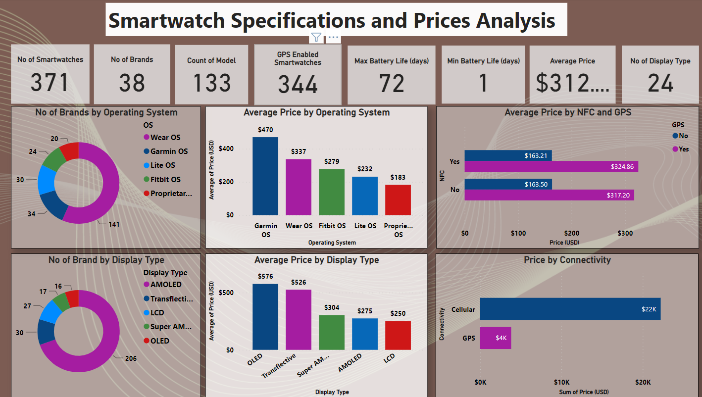
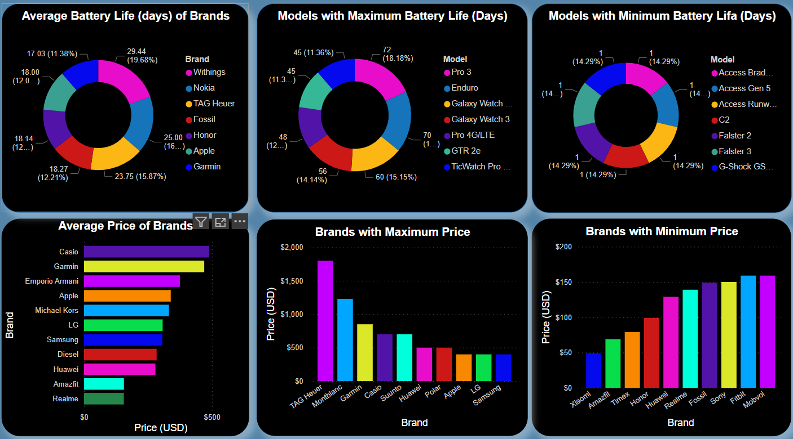

# SkilHarvest-Data-Analysis-Final-Group-Project

**Documentation Outline**
---

-[Project Overview](#project-overview)

-[Data Source](#data-source)

-[Tools Used](#tools-used)

-[Data Cleaning and Preparation](#data-cleaning-and-preparation)

-[Exploratory Data Analysis](#exploratory-data-analysis)

-[Data Visualization and Findings](#data-visualization-and-findings)

-[Conclusion and Recommendations](#conclusion-and-recommendations)

-[Glossary](#glossary)

# Project Overview
---

This project involved a dataset containing data on the prices of different brands and models of smartwatches available in the market. The datasets give information about the smartwatches' specifications and how they affect the market price. This data analysis project aims to explore the various specifications of wristwatch brands and look at the more suitable brands in terms of functionality, health specifications, and cost-efficiency for buyers.

# Data Sources
---
This data was sourced from Kaggle.com, an online source for diverse datasets [https://www.kaggle.com/datasets/rkiattisak/smart-watch-prices]

# Tools Used
--- 
Microsoft Excel - for primarily housing the data
Power BI - for data cleaning, transformation, exploratory data analysis, and visualization

# Data Cleaning and Manipulation
---
Cleaning and transformation of the data were performed in the Power BI query which included the following:

1. Changing of data types
2. Splitting of columns
3. Creating conditional columns to create more measures
4. Removing empty and duplicate rows
5. Removing N/As
7. Made sure the values are consistent within the column for better visualization

# Exploratory Data Analysis
---

The data set contains 371 different smartwatch models with different specifications that influence the price of the smartwatches. The following are the insights to be derived from the analysis:

1.	Total number of smartwatches in the dataset
2.	Total number of smartwatch brands in the dataset
3.	Maximum battery life of smartwatches in the dataset
4.	Minimum battery life of smartwatches in the dataset
5.	Average price of a smartwatch in the dataset
6.	Total number of distinct display types used by smartwatches in the dataset
7.	What are the most common types of operating systems used by the brands?
8.	How does the most common OS affect the price?
9.	What are the most common types of displays used by these smartwatches?
10.	How does the most popular display type affect the price?
11.	Comparison between the cellular and GPS connectivity and how they affect the price
12.	Comparison between NFC and GPS and their effect on Price – The price increases with the presence of GPS whether or not it does have NFC or not. The presence or absence of NFC does not affect the price of the smartwatches.
13.	Which smartwatches have the health benefit feature of a heart rate monitor and how this affects the price?

# Data Visualization and Findings
---

*Findings*
1. There are a total of 371 smartwatches in the dataset with 38 distinct brands, 133 distinct model of smartwatches, and 24 different display type of smartwatches. From the data, there are 344 GPS enabled smartwatches and the average price of a smartwatch is $312.

2. Wear OS is the most used operating system by the smartwatches in this data totalling 38% of the total smartwatches. It is followed by Garmin OS which is used by 9% of the smartwatches.

3. AMOLED is the most common display type featured by the smartwatches in this data totalling up to 56% of the total smartwatches.

4. Despite that Wear OS is the most used operating system, Smartwatches with Garmin Operating system is more expensive in terms of price compared to Wear OS. On the average, a smartwatch with Garmin operating system costs $470.

5. Despite that AMOLED display type is used by 56% of the smart watches and OLED display type is used by 4%, smartwatches with OLED display type are higher in price ($576) compared to AMOLED ($304).

6. The price of the smartwatches are not affected by NFC feature. However, when compared with the GPS feature, the price of the smart watch increases with or without NFC features, suggesting that GPS feature most likely increases the price of the smartwatches unlike the NFC features.

7. Smartwatches with the cellular type of connectivity have higher price compared to those with the GPS connectivity. This suggests that cellular connectivity is more preferred in a smartwatch.

8. The Maximum battery life of a wristwatch in the dataset is 72 days while the minimum is 1 day.

Findings
1. Smartwatch model Pro 3 has the maximum battery life of 72 days, followed by Enduro with 70 days, Galaxy Watch at 60 days, and Galaxy Watch 3 at 56 days

2. Access Brad, Access Gen 5, Access Runway, C2, Falster 2, Falster 3, and G-Shock GS all have a minimum battery life of 1 day.

3. The TAG Heuer smartwatch brand is the most expensive with the average price of $1,537 while Xiaomi smartwatch brand is the least expensive with the average price of $137 USD.

# Glossary:
---

1. Brand: the manufacturer of the smartwatch
2. Model: the specific model of the Smartwatch’s brand
3. Operating System: the operating system used by the smartwatch (e.g. watchOS, Wear OS, Garmin OS, Fitbit OS, etc.)
4. Connectivity: the types of connectivity supported by the smartwatch (e.g. Bluetooth, Wi-Fi, Cellular)
5. Display Type: the type of display technology used by the smartwatch (e.g. AMOLED, Retina, E-Ink, LCD)
6. Display Size: the size of the smartwatch's display in inches
7. Resolution: the resolution of the smartwatch's display in pixels
8. Water Resistance: the depth (in meters) to which the smartwatch can be submerged in water without damage
9. Battery Life: the estimated battery life of the smartwatch in days
10. Heart Rate Monitor: whether or not the smartwatch has a built-in heart rate monitor
11. GPS: whether or not the smartwatch has built-in GPS (Global Positioning System) for location tracking
12. NFC: whether or not the smartwatch has NFC (Near Field Communication) for contactless payments or other wireless data transfer
13. Price: the amount (USD) of the smartwatch in the market
